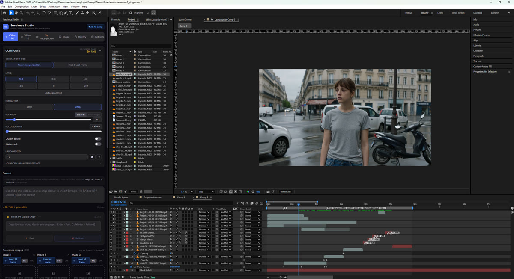
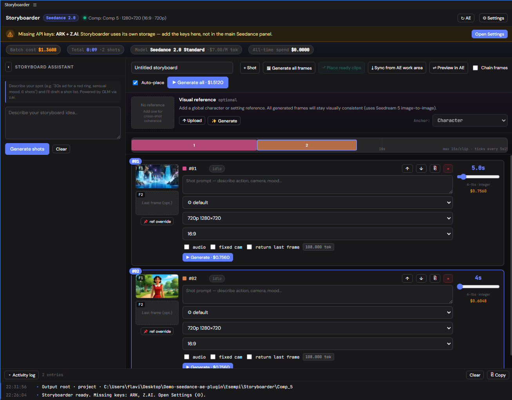

# Seedance Studio for After Effects

<p align="center">
  <a href="https://justae.homolapis.ai/">
    <picture>
      <source media="(prefers-color-scheme: dark)" srcset="branding/justae-logo-dark.svg">
      
    </picture>
  </a>
</p>

<p align="center">
  <strong>This is the open-source version of <a href="https://justae.homolapis.ai/">JustAE</a>.</strong><br/>
  The commercial JustAE adds <strong>ComfyUI</strong> and <strong>ComfyCloud</strong> integration (model-agnostic, minimal workflow), and <strong>DaVinci Resolve</strong> ports are in development.
</p>

<p align="center">
  <a href="LICENSE"></a>
  <a href="https://www.adobe.com/products/aftereffects.html"></a>
  <a href="https://console.byteplus.com/ark"></a>
  <a href="https://homolapis.ai"></a>
</p>

<p align="center">
  <picture>
    <source media="(prefers-color-scheme: dark)" srcset="docs/hero-dark.svg">
    
  </picture>
</p>

<p align="center">
  
</p>

> The first open-source After Effects panel that puts Seedance 2.0
> (and friends like HappyHorse 1.0) one click away from your timeline.
> As far as we can tell, also the first AE panel of any kind doing
> this. Prove us wrong, we'll buy you a coffee. Generate, drop on the
> playhead, keep working. No backend, no Python, no "Open Postman",
> no "first install Docker".
>
> **Licensed under GPL-3.0. Fork it, hack it, ship it in your shitty
> startup. We mostly want to stop being on call for BytePlus' product
> roadmap.**

`info@homolapis.ai` · [homolapis.ai](https://homolapis.ai)

---

## Why this exists (the short, slightly bitter version)

Here's the workflow most editors fall into when they first try to use
Seedance / Dreamina / any web playground for a real edit:

1. Write prompts in a Google Doc.
2. Paste them, one by one, into the vendor's web playground.
3. Download N MP4s into `~/Downloads/seedance-final-FINAL-v3-good.mp4`.
4. Drag them, one by one in the right order at the right frame, into
   After Effects.

Most of the time spent isn't the actual model inference. It's the
manual round-trip between browser and AE.

We built this plugin to collapse that round-trip into a click.

Seedance Studio lives inside After Effects. You pick a comp, type a prompt
(or scan a board of stills you already laid down on the timeline), and shots
land on the playhead at the right frame, named, ordered, ready to grade.
We didn't find any other professional plugin doing this for AE.

Full disclosure: this thing was vibecoded. It works and it's sellable,
but the code is probably a mess in places. `host/index.jsx` is a single
1200-line file, `App.jsx` is roughly 3000 lines, and we haven't done a
serious cleanup pass. If you open it expecting a tidy codebase, you
won't find one.

We're publishing it anyway because (a) it solves a real problem nobody
else is solving for AE, and (b) we'd rather you fork the messy version
than sit there reinventing it from scratch. PRs that clean things up
are very welcome.

So here you go. The whole thing, GPL-3.0, take what you want.

---

## What it does

Two panels under **Window → Extensions**:

### 🎬 Seedance Studio (main panel)

<p align="center">
  
</p>

- **Text → Video** with Seedance 2.0 (standard / fast) on BytePlus ARK.
- **Image → Video**: drop a still, get motion.
- **Video → Video** with reference clips (when the model supports it).
- **🐎 HappyHorse 1.0** (Alibaba Cloud / DashScope): an alternative
  engine with four modes: text→video, first-frame, multi-reference, and
  video-edit. Useful when ARK queues are slow or for region-specific
  routing (CN / Intl / US).
- **Depth + Pose preprocessors via fal.ai**: extract a depth-map
  video (Depth Anything) or a pose-skeleton video (DWPose,
  OpenPose-equivalent) from any clip. Drop the result on the timeline
  as a side-by-side layer for ControlNet-style downstream work.
- **Prompt assistant** powered by Z.AI (optional): fixes lazy prompts.
- **Asset library** + **History** so you never lose a generation.
- **Cost estimator** that tells you, before you hit Generate, what you're
  about to spend. Formula:

  Prices as of May 2026. BytePlus changes them. Verify current rates
  on the ARK console before you bet money on the estimate.

  ```text
  tokens   = (width × height × 24 × duration_seconds) / 1024
  cost_usd = tokens / 1_000_000 × $7.00   (standard model)
           = tokens / 1_000_000 × $5.60   (fast model)
  ```
  Lifetime spend is tracked locally in `localStorage`. We do not phone
  home. We do not have a home.

- **Spending tracker** (because the day you lose track of "how much did I
  spend on AI video this month?" is the day your client calls.)
- **One-click drop** of finished videos onto the active comp at the
  current playhead.

### 🎨 Storyboarder (companion panel)

<p align="center">
  
</p>

> **Heads up.** The Storyboarder panel is still under active
> development. The core flow works (scan, prompt per shot, batch
> generate, replace placeholders), but it hasn't had the same testing
> pass as the main panel: expect rough edges, missing polish, the
> occasional confused state. Feedback via issues is gold right now.

- Lay down stills on your AE timeline like an animatic.
- Click **Scan** → it reads the work area, extracts each still + duration.
- Type prompts per shot, hit **Generate all**, go make coffee.
- When renders arrive, **Replace placeholders** swaps every still with its
  matching MP4 *at the same in-point*. The animatic becomes the cut.

A multi-shot board that used to be a manual drag-and-drop chore becomes
unattended GPU time + one click to swap.

---

## What it does NOT do

- It does not run a server. There is no `pip install`, no `docker compose`,
  no `node server.js`. The CEP panel calls vendor APIs directly from inside
  After Effects. The only thing it persists is your API keys (in
  `localStorage`, on your machine).
- It does not relay your keys anywhere. They go straight from the panel to
  BytePlus / Z.AI / FAL / Alibaba. We literally have no backend.
- It does not bypass the 15-second cap on Seedance generations. That's a
  vendor limit, not ours.
- It is not signed. Adobe charges for that and we are not a Fortune 500.
  Installation enables CEP debug mode for you (see below).
- It does not work on Premiere, Photoshop, or Resolve. PRs welcome if you
  want to port the host script. The React UI is host-agnostic.
- It does not host your reference images privately. Image-to-video
  and video-to-video send references through a public temporary file
  host (tmpfiles.org) to give vendor APIs a URL they can fetch. Files
  auto-expire on their side, but: do not use this for NDA-bound work
  without configuring your own bucket. PR welcome for S3 / R2 / MinIO
  support.

---

## Requirements

| Thing                                   | Why                                  |
|-----------------------------------------|--------------------------------------|
| Adobe **After Effects CC 2020 (v17.0)** or newer | The manifest declares `AEFT [17.0,99.0]`. Recent versions are recommended. |
| **BytePlus ARK** account + API key      | The actual model. Pay-as-you-go.     |
| (optional) **Z.AI** key                 | Prompt assistant (GLM-4 flash).      |
| (optional) **FAL** key                  | Alternate model routes (Hunyuan etc.)|
| (optional) **Alibaba Dashscope** key    | Region-restricted models.            |
| Windows 10/11 **or** macOS 11+          | Where Adobe runs. Primary dev/test is on Windows. |

Get keys:
- ARK → https://console.byteplus.com/ark
- Z.AI → https://z.ai
- FAL → https://fal.ai
- Alibaba Dashscope → https://modelstudio.console.alibabacloud.com/

Your keys live **only on your machine**, in browser-style `localStorage`
under the CEP runtime. Format: `seedance_ark_key`, `seedance_zai_key`, etc.

---

## Install (5 minutes, 0 dependencies)

### Windows
```bat
:: Double-click, or from a terminal:
install.bat
```
It enables CEP debug mode (CSXS 8–12) and copies the bundle to
`%APPDATA%\Adobe\CEP\extensions\com.seedance.studio`.

### macOS
```bash
chmod +x install.sh
./install.sh
```
Same idea, with `defaults write com.adobe.CSXS.N PlayerDebugMode 1` and a
copy to `~/Library/Application Support/Adobe/CEP/extensions/com.seedance.studio`.

Then:
1. Restart After Effects.
2. **Window → Extensions → Seedance Studio** (and **Storyboarder**).
3. Click ⚙ **Settings**, paste your ARK key. Pick a model. Done.

Uninstall: `uninstall.bat` / `uninstall.sh`.

Once installed, see **[docs/USAGE.md](docs/USAGE.md)** for the
day-to-day workflow: single-shot generation, the Storyboarder flow,
prompt tips, cost recipes, and troubleshooting.

---

## Repository layout

```
seedance-ae-plugin/
├── CSXS/manifest.xml              ← CEP manifest, 2 panels declared here
├── client/                        ← Main panel (CEP-loadable as-is)
│   ├── index.html
│   ├── ae-bridge.js               ← Promisified evalScript() wrappers
│   ├── lib/CSInterface.js         ← Adobe CEP runtime (MIT)
│   └── assets/
│       ├── index.js               ← Built React bundle
│       └── index.css
├── client-storyboarder/           ← Storyboarder panel (drop-in build)
│   ├── index.html
│   ├── ae-bridge-storyboarder.js
│   ├── storyboarder.js            ← Pre-built (sources not in repo yet)
│   ├── storyboarder.css
│   └── lib/CSInterface.js
├── host/index.jsx                 ← ExtendScript: import, layout, render
├── frontend-src/                  ← React source for the MAIN panel
│   ├── package.json
│   ├── vite.config.js
│   └── src/                       ← App.jsx, api.js, components, hooks
├── scripts/                       ← build-ui.sh / build-ui.bat
├── install.{bat,sh} / uninstall.{bat,sh}
├── docs/                          ← Architecture, API notes
└── LICENSE
```

The Storyboarder UI ships as a pre-built `storyboarder.js`. It was
authored more directly and we haven't yet split out a clean source tree
for it. If there's demand we'll factor it out into `frontend-src/`; open
an issue if you'd find that useful.

---

## Rebuild the main UI from source

```bash
cd frontend-src
npm install
npm run build:cep        # → emits into ../client/assets/
# then push to AE:
cd ..
./install.sh             # macOS
install.bat              # Windows
```

Or use the helper: `scripts/build-ui.sh` / `scripts/build-ui.bat`.

For UI iteration without round-tripping through AE, run `npm run dev` and
preview at `http://localhost:5173`. When `window.AEBridge` is absent the
AE-dependent actions become no-ops, but the rest of the UI still renders,
which is enough to iterate on layout and styling.

See [docs/ARCHITECTURE.md](docs/ARCHITECTURE.md) for how the React side
talks to ExtendScript talks to AE.

---

## Architecture in one paragraph

A CEP panel is a Chromium webview embedded inside After Effects. The UI
(React + Vite + Tailwind) runs in that webview. Whenever it needs AE to
*do* something (import a file, place a layer at the playhead, render the
work area), it serializes a function call to a string and ships it via
`CSInterface.evalScript()` to `host/index.jsx`, which runs in AE's
ExtendScript engine. The host returns JSON. The bridge in `client/ae-bridge.js`
hides the string-serialization gymnastics behind a clean Promise API.
Everything else (auth, API calls, history, cost math) is plain browser JS
inside the panel. No native code, no native dependencies.

---

## Commercial & support

This repo is GPL-3.0. Help yourself.

What we sell on top of the open-source release:

- **Custom builds for premium agencies.** Your brand, your models,
  your pipeline (Frame.io, Slack, S3, custom upscaling, custom render
  queue, whatever your team needs). Built on top of this codebase,
  tailored to how your team actually works.
- **Training & workshops.** Half-day or full-day, remote or on-site,
  on how to integrate generative video into a working creative
  pipeline without losing artistic control.
- **Priority support.** SLA + first call on bugs and feature
  requests. Talk to us.

`info@homolapis.ai` · [homolapis.ai](https://homolapis.ai)

---

## Roadmap

Short version of what we want to land, in rough order:

- More model adapters: Wan 2.5, Kling 3.0, Hunyuan, Veo 3 (via fal or
  direct).
- Configurable reference-image bucket (S3 / R2 / MinIO) so NDA work
  has a clean path.
- Pricing table externalized to `pricing.js` so estimates stay current
  without a release.
- Open source tree for the Storyboarder panel (currently ships
  pre-built).
- UXP migration scoping, for when Adobe finally retires CEP.
- Premiere Pro host script port. The React UI is host-agnostic
  already.

See open issues for what's actually in flight. PRs welcome on any of
the above; open an issue first so we don't duplicate work.

See also [ROADMAP.md](ROADMAP.md) for the same list as a standalone
document.

---

## Crediting this project

Under **GPL-3.0**, the obligations only trigger when you **distribute**
the plugin (or a fork of it) outside your own team. For internal use
(install, modify for your own workflow, use to make videos) there is
no obligation to publish anything.

If you do distribute, then:

1. Keep the `LICENSE` file (with the copyright line) in your
   distribution.
2. Release your modifications and the source code under GPL-3.0.
3. Preserve copyright notices and clearly state what you changed.

The code is the least of what's on offer. The real work is the product
design: the panel layout, the storyboard-replace flow, the cost math,
the way the plugin speaks to AE, the professional motion-design /
videomaking workflow it implements. New features in the same direction
are in the pipeline. **That's what we'd appreciate being credited for**,
in addition to the LICENSE-level attribution that GPL-3.0 requires.

**As a courtesy on top of GPL-3.0**, if you distribute a derivative
please keep a visible mention somewhere user-facing: an *About*
panel, your fork's README, a docs footer, anything along the lines
of:

> Based on [Seedance Studio](https://github.com/HomoLapis/seedance-ae-plugin)
> by [Homo Lapis](https://homolapis.ai)

---

## Contributing

Yes please. See [CONTRIBUTING.md](CONTRIBUTING.md).

A few sensible defaults:

- One feature per PR, with a screenshot / GIF / 5-second screencap.
- Don't add a `console.log("here")`. Or do, and we'll roast you in the
  review.
- Anything that touches `host/index.jsx` *must* be wrapped in
  `app.beginUndoGroup()`/`endUndoGroup()`. Users will hit ⌘Z and they
  must not lose work.
- No tracking, no telemetry, no "improve the product by sharing your
  prompts with us". Ever.

---

## FAQ

**Q: How do I actually use this once installed?**
A: Open **[docs/USAGE.md](docs/USAGE.md)**. Step-by-step for both
panels, prompt tips, cost recipes, troubleshooting.

**Q: Will this work for the agency I run?**
A: Yes. The plugin is GPL-3.0, but GPL obligations only kick in on
**distribution of the software**, not on use. If your agency
installs the plugin on its workstations, makes videos for clients,
and delivers the videos: nothing to share, nothing to publish. The
videos are output, not derivative works. Same if you modify the
plugin internally for your own workflow: as long as the modified
plugin stays inside your team, no obligation triggers. GPL applies
if you redistribute the plugin (or a modified fork) outside your
agency, for example as part of a toolkit you ship to clients or as
a fork on GitHub.

**Q: Why two separate panels instead of tabs in one?**
A: Different muscle memory. Storyboarder is the "boards → motion" flow,
Seedance Studio is the "single hero shot" flow. Editors keep them in
different docking positions.

**Q: My ARK key has weird characters / I'm scared to paste it.**
A: The Settings UI uses `<input type="password">` and the key is written
to `localStorage` only. We never serialize it anywhere else, never log it,
never POST it to any host that isn't a documented vendor endpoint. You
can grep the source: `seedance_ark_key`.

**Q: I made a sick fork. Can I list it?**
A: Open a PR adding it to a `SHOWCASE.md`. We'll link it.

**Q: Bug?**
A: Open an issue with: AE version, OS, the steps, and (if applicable) the
exact prompt + resolution + duration that triggered it. "It doesn't work"
issues will be closed with love.

---

## Credits

- Built by [Homo Lapis](https://homolapis.ai).
- Uses Adobe's `CSInterface.js` from the [Adobe-CEP](https://github.com/Adobe-CEP/CEP-Resources)
  resources, under MIT.

---

## Not affiliated with anyone

This is an independent third-party project. We are **not** affiliated
with, endorsed by, sponsored by, or partnered with any of the vendors
whose APIs this plugin talks to, including ByteDance, BytePlus
(Seedance, Dreamina, Doubao, ARK), Adobe, Z.AI, Alibaba (DashScope,
Tongyi Wanx / "HappyHorse"), or fal.ai.

All product names, logos, and trademarks belong to their respective
owners. We use these APIs strictly as paying customers, like anyone
else with a credit card. See [LICENSE](LICENSE) for the formal notice.

---

*If this saves you a day of work, consider [sponsoring](https://homolapis.ai)
or just emailing us a screenshot of the spot you cut with it. Both are
appreciated. The second more than the first.*
