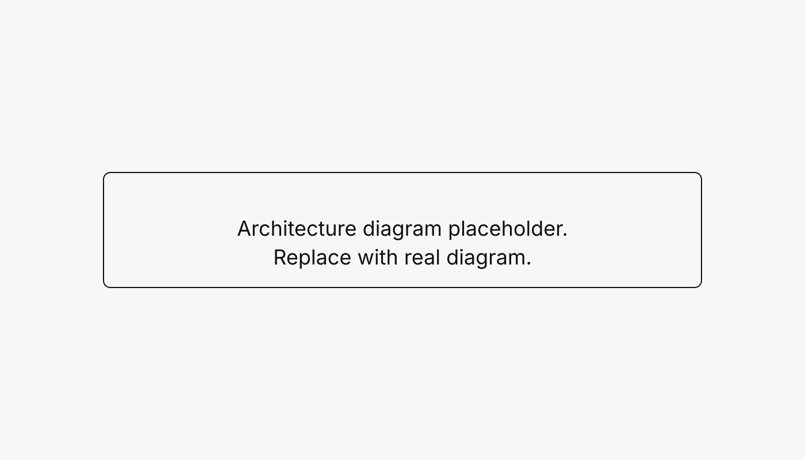

# Architecture

<p align="center">
  <picture>
    <source media="(prefers-color-scheme: dark)" srcset="diagrams/architecture-dark.svg">
    
  </picture>
</p>

*(The ASCII version below is kept for accessibility and grep-ability.)*

```
   ┌─────────────────────────────────────────────────────────────┐
   │                     After Effects                            │
   │                                                              │
   │   ┌───────────────────────────────────────────────────┐      │
   │   │       CEP Panel (Chromium webview, NodeJS)         │      │
   │   │                                                     │      │
   │   │   React UI (frontend-src → client/assets/index.js) │      │
   │   │             │                                       │      │
   │   │             ▼                                       │      │
   │   │   ae-bridge.js  ──  Promisified evalScript()       │      │
   │   │             │                                       │      │
   │   │             ▼                                       │      │
   │   │   CSInterface.js (Adobe runtime)                   │      │
   │   └───────────────────┬───────────────────────────────┘      │
   │                       │ evalScript(stringified call)         │
   │                       ▼                                       │
   │   ┌───────────────────────────────────────────────────┐      │
   │   │   ExtendScript engine  (host/index.jsx)           │      │
   │   │                                                     │      │
   │   │   importVideoFile / placeStoryboardClips / ...     │      │
   │   │     ↳ talks to AE DOM (CompItem, Layer, Footage)   │      │
   │   └───────────────────────────────────────────────────┘      │
   └──────────────────────────────────────────────────────────────┘

   ── outbound network (from the React side only) ──
       BytePlus ARK   ──  text/image/video → video
       Z.AI            ──  GLM-4 flash, prompt assist
       FAL             ──  alternate model routes
       Alibaba         ──  region-restricted models
       tmpfiles.org    ──  ephemeral hosting for refs
```

## Key files

### `CSXS/manifest.xml`
Declares **two** panel extensions inside one bundle:
- `com.seedance.studio.panel`  → main panel (`client/index.html`)
- `com.seedance.studio.storyboarder` → boards panel (`client-storyboarder/index.html`)

Both point at the same `host/index.jsx`, so host functions can be reused
between panels.

### `host/index.jsx`
Plain ES3-flavored ExtendScript. Every entry point:
- Validates the active composition exists.
- Wraps mutations in `app.beginUndoGroup` / `endUndoGroup`.
- Returns a JSON string (the panel `JSON.parse`s it).
- Catches everything and returns `{ error: "..." }` instead of throwing.

Notable helpers:
- `importAndAddToTimeline(path, layerName)`: main "drop on playhead" entry.
- `captureCurrentFrameToFile(path)`: used for image references.
- `renderWorkAreaToFile(maxSec)`: render-queue-driven preview render (15s cap).
- `scanWorkAreaImages()`: Storyboarder's board scanner.
- `placeStoryboardClips`, `insertStoryboardPlaceholders`,
  `replacePlaceholdersWithRenders`: animatic to cut flow.

### `client/ae-bridge.js` & `client-storyboarder/ae-bridge-storyboarder.js`
Tiny façade. Each method takes friendly JS args, hand-escapes them into
an ExtendScript source string (Windows paths through ExtendScript +
JSON.parse is a minefield, see the comment in
`ae-bridge-storyboarder.js`), calls `evalScript`, parses the JSON result.

### `frontend-src/src/api.js`
All vendor SDK glue. Each model family has its own helper:
- `byteplus*`: the main Seedance flow.
- `zai*`: prompt assistant.
- `fal*`: Hunyuan/Wan/etc.
- `dashscope*`: Alibaba region routes.

API keys come from `localStorage`; no env vars at runtime (this is a
browser-style context).

### `frontend-src/src/App.jsx`
Top-level state machine. Tabs (see the tab list around line 976):
`video` (Seedance 2.0), `video15` (Seedance 1.5), `happyhorse`, `image`,
`history`, plus a separate Settings view.

### `frontend-src/src/hooks/useAfterEffects.js`
Polls `AEBridge.checkReady()` every 3 s while inside AE so the UI knows
when a comp is selected (and its dimensions). When `window.AEBridge` is
absent (i.e. running standalone in a browser), the hook simply doesn't
start polling and `isAE` stays `false`; AE-dependent actions become
no-ops, the rest of the UI still renders, so layout and styling can be
iterated in a normal browser tab.

## State persistence

Everything sits in `localStorage` under the `seedance_*` namespace:

| Key                              | What                              |
|----------------------------------|-----------------------------------|
| `seedance_ark_key`               | BytePlus ARK API key              |
| `seedance_zai_key`               | Z.AI API key                      |
| `seedance_fal_key`               | FAL API key                       |
| `seedance_alibaba_key`           | Alibaba Dashscope key             |
| `seedance_hh_region`             | Alibaba region                    |
| `seedance_model`                 | "standard" or "fast"              |
| `seedance_output_dir`            | Default download folder           |
| `seedance_total_spent`           | Lifetime USD spend (local only)   |
| `seedance_history`               | Recent generations (JSON array)   |
| `seedance_asset_library`         | Saved asset library (JSON)        |
| `seedance_auto_host`             | Auto-upload refs to tmpfiles      |
| `seedance_asset_beta_dismissed`  | UX flag                           |

The Storyboarder panel re-reads the same keys, so configuring once is
enough for both.

## Build & install loop

```
edit frontend-src/src/**
       │
       ▼
npm run build:cep    →   client/assets/index.{js,css} are regenerated
       │
       ▼
./install.sh          →   files are copied to the CEP extensions folder
       │                  ($APPDATA / ~/Library/Application Support)
       ▼
restart After Effects →   panel reloads from disk
```

The Storyboarder UI is currently shipped as a pre-built `storyboarder.js`.
A clean source tree for it isn't in this repo yet. Open an issue if you
need it.

## Why two panels and not one tabbed UI?

They're separate workflows: Storyboarder is "lay down boards → batch
generate → replace placeholders", the main panel is "single-shot
generation". The CEP manifest registers them as two independent panels
so editors can dock them in different positions of the AE workspace. The
default panel sizes in `CSXS/manifest.xml` reflect that: different
defaults for each.
